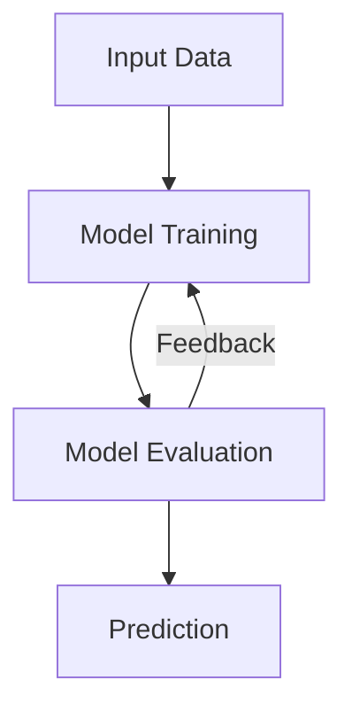
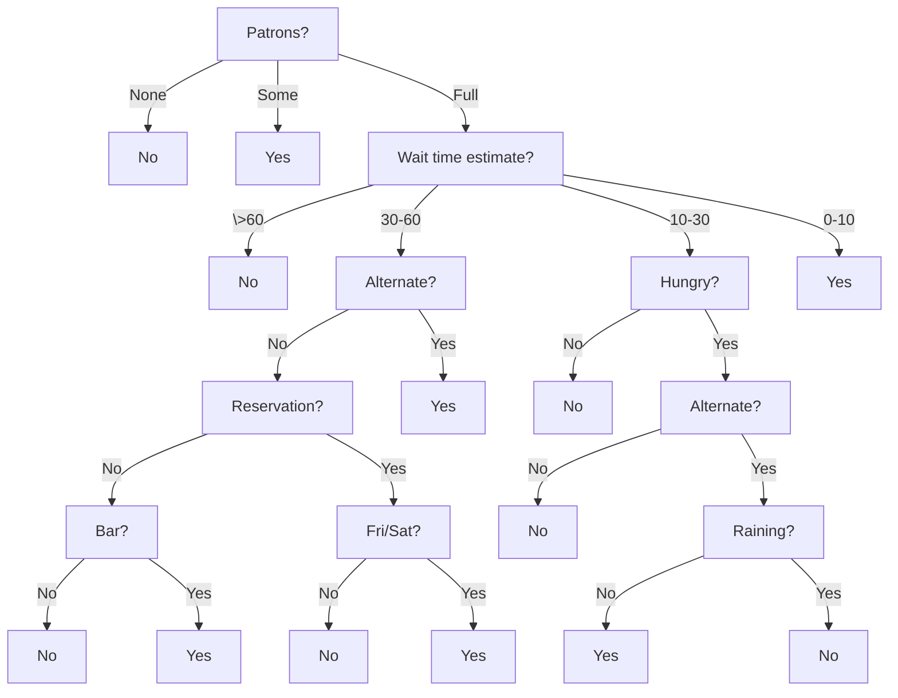
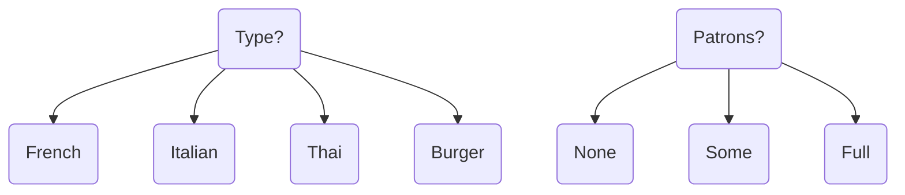
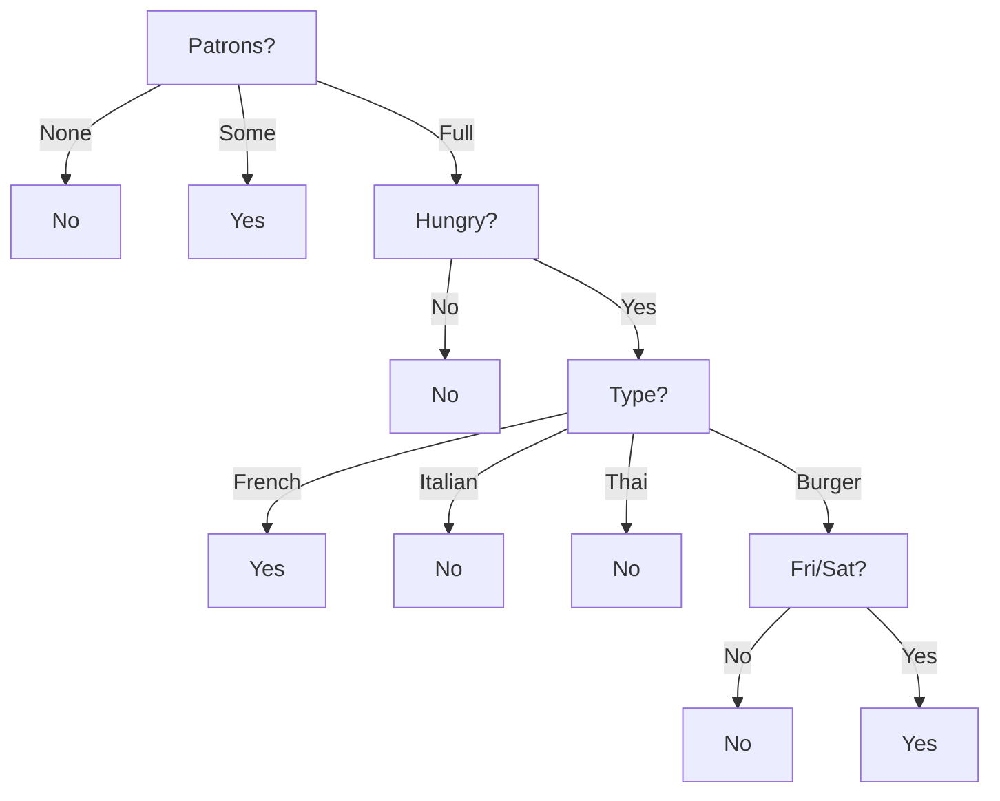
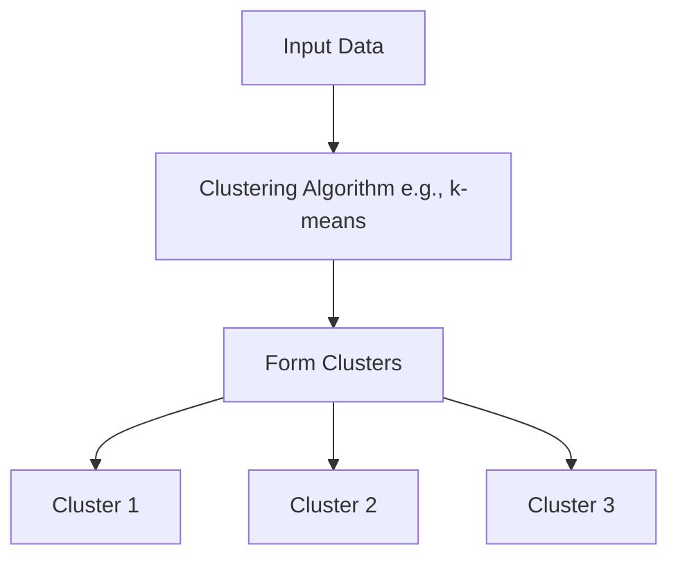

# Introduction to Machine Learning (Topics 7 - 12)

## 7. Different Approaches to Machine Learning

Machine learning encompasses various approaches, each with distinct methods, data requirements, and limitations. Understanding these approaches: **supervised learning**, **unsupervised learning**, and **reinforcement learning** is essential for selecting the appropriate technique for a given problem space.

### Supervised Learning

**Overview**:
In supervised learning, models are trained on labeled datasets, where each input is paired with the correct output. This approach is prevalent in classification and regression tasks, such as image recognition and predictive analytics.

**Data Requirements**:

- Requires large, labeled datasets to achieve high accuracy.
- Data must be representative of all classes to avoid biases.

**Limitations**:

- Data labeling is time-consuming and resource-intensive.
- Models may overfit if trained on datasets that do not generalize well to new instances.
- Performance heavily depends on the quality and quantity of labeled data available.

### Unsupervised Learning

**Overview**:
Unsupervised learning deals with unlabeled data, aiming to discover underlying patterns or structures within the dataset. It is useful for clustering, dimensionality reduction, and anomaly detection.

**Data Requirements**:

- Can operate on raw, unlabeled datasets, reducing costs associated with data preparation.
- Requires data preprocessing to enhance feature relevance.

**Limitations**:

- Results may be less interpretable and require domain expertise to make meaningful conclusions.
- Lacks specificity in guiding precise tasks, like classification, compared to supervised methods.
- Validation and evaluation of results can be challenging due to the absence of ground truth.

### Reinforcement Learning

**Overview**:
Reinforcement learning trains agents to make a sequence of decisions by interacting with an environment, maximizing cumulative rewards. This approach is prominent in robotics, game AI, and autonomous systems.

**Data Requirements**:

- Requires a well-defined environment with a reward system to simulate interactions.
- Often benefits from simulated data to expedite training.

**Limitations**:

- High computational demands and complexity in learning optimal strategies.
- Sample inefficiency, requiring extensive interactions to learn effectively.
- Designing appropriate reward functions can be challenging and crucial for success.

### Key Points

- **Data Reliance**: Supervised learning depends heavily on labeled data, while unsupervised can discover patterns without it. Reinforcement learning needs an interactive environment and a reward structure.
- **Use Cases**: Supervised learning is ideal for tasks with clear input-output pairs, unsupervised for exploratory analysis, and reinforcement for decision-making processes.
- **Challenges**: Each approach has unique limitations, from data-related issues in supervised learning to environmental complexity in reinforcement learning.

## 8. The basic concept of supervised learning

Supervised learning focuses on using labeled datasets to train models that predict outcomes or classify data points into categories. It involves input-output pairs, where the model learns a mapping function to associate input features with correct outputs, enabling accurate predictions on unseen data.

The strength of supervised learning lies in its ability to leverage labeled information for precise predictions. It applies to various domains, including image recognition, language processing, and predictive analytics. A major constraint is the reliance on large, accurately labeled datasets, which can be costly to obtain.

### More formal

Given a training set of $n$ input-output pairs $(x_1, y_1), (x_2, y_2), ..., (x_n, y_n)$, where each pair was generated by an unknown function $y = f(x)$, the goal is to discover a function $h$ that approximates $f$ as closely as possible.

$h$ is called a **hypothesis** or a **model** of the data, and the learning process involves finding the optimal parameters for $h$ that minimize the difference between $h(x)$ and $y(x)$.

#### Underfitting and Overfitting

- **Underfitting**: Occurs when the model is too simple to capture the underlying patterns in the data, leading to high bias and low variance.
- **Overfitting**: Happens when the model is too complex, capturing noise in the training data and failing to generalize well to new instances, resulting in low bias and high variance.

### Example Figure of Supervised Learning

Below is a simple depiction of the supervised learning process:

- **Input Data**: Features $x_1, x_2, ... , x_n$ paired with Labels $y_1, y_2, ... , y_n$.
- **Model Training**: Learn the mapping from inputs to outputs using a supervised learning algorithm.
- **Model Evaluation**: Assess the model's performance on a separate validation dataset.
- **Prediction**: Use the trained model to make predictions on new, unseen data.

Here’s how you might visualize it:

### Key Points

- **Labeled Data**: Supervised learning requires labeled data for training, where each input is associated with the correct output.
- **Model Training**: The goal is to learn a function that approximates the underlying data distribution, enabling accurate predictions on unseen instances.
- **Bias-Variance Tradeoff**: Balancing model complexity is crucial to avoid underfitting and overfitting.
- **Evaluation**: Models are evaluated based on their performance on validation or test datasets, ensuring generalization to new data.

## 9. Supervised learning by decision trees

Decision trees are a supervised learning approach that models decisions and their possible consequences as a tree structure. Each node represents a decision based on a feature value, while branches represent the outcomes leading to leaf nodes, which are predictions. Decision trees are intuitive, easily interpretable, and effective for both classification and regression tasks.

Constructing a decision tree involves selecting features that best split data at each node, often using criteria like information gain. A limitation is their tendency to overfit training data, making techniques like pruning, which simplifies the tree, essential for enhancing generalization to unseen datasets.

### Generalized Workflow

Maps a vector of **attribute values** to a single output **"decision"**.

#### Sequence of tests

1. Start at the root node.
2. Explore branches based on attribute values.
3. Reach a leaf node with the final decision.

Nodes represent **features**, edges **decisions**, and leaves **outcomes**.

Input and output values can be **discrete** or **continuous**.

Simplest example is a boolean decision tree. Which is equivalent to a logical statement of form:

$$
\text{Output} \iff (\text{Path}_1 \land \text{Path}_2 \land \ldots \land \text{Path}_n)
$$

### Example (Restuarant Waiting)

Description of steps in a decision tree for a restaurant waiting scenario:

1. Alternate: whether there is a suitable alternative restaurant nearby.
2. Bar: whether the restaurant has a comfortable bar area to wait in.
3. Fri/Sat: true on Fridays and Saturdays.
4. Hungry: whether we are hungry right now.
5. Patrons: how many people are in the restaurant (values are None, Some, and Full).
6. Price: the restaurant’s price range ($, $$, $$$).
7. Raining: whether it is raining outside.
8. Reservation: whether we made a reservation.
9. Type: the kind of restaurant (French, Italian, Thai, or burger).
10. WaitEstimate: host’s wait estimate: 0–10, 10–30, 30–60, or >60 minutes

#### Dataset

| Example | Alt | Bar | Fri | Hun | Pat  | Price | Rain | Res | Type    | Est   | Output    |
| ------- | --- | --- | --- | --- | ---- | ----- | ---- | --- | ------- | ----- | --------- |
| x₁      | Yes | No  | No  | Yes | Some | $$$   | No   | Yes | French  | 0-10  | y₁ = Yes  |
| x₂      | Yes | No  | No  | Yes | Full | $     | No   | No  | Thai    | 30-60 | y₂ = No   |
| x₃      | No  | Yes | No  | No  | Some | $     | No   | No  | Burger  | 0-10  | y₃ = Yes  |
| x₄      | Yes | No  | Yes | Yes | Full | $     | Yes  | No  | Thai    | 10-30 | y₄ = Yes  |
| x₅      | Yes | No  | No  | No  | Full | $$$   | No   | Yes | French  | >60   | y₅ = No   |
| x₆      | No  | Yes | Yes | Yes | Some | $$    | Yes  | Yes | Italian | 0-10  | y₆ = Yes  |
| x₇      | No  | Yes | No  | No  | None | $     | Yes  | No  | Burger  | 0-10  | y₇ = No   |
| x₈      | No  | No  | No  | Yes | Some | $$    | Yes  | No  | Thai    | 0-10  | y₈ = Yes  |
| x₉      | No  | Yes | Yes | No  | Full | $     | Yes  | No  | Burger  | >60   | y₉ = No   |
| x₁₀     | Yes | Yes | Yes | No  | Full | $$$   | No   | Yes | Italian | 10-30 | y₁₀ = No  |
| x₁₁     | No  | No  | No  | No  | None | $     | No   | No  | Thai    | 0-10  | y₁₁ = No  |
| x₁₂     | Yes | Yes | Yes | No  | Full | $     | No   | No  | Burger  | 30-60 | y₁₂ = Yes |

#### Processing

Find most significant features and split the data accordingly.

E.g. Patrons, Price, and Type are significant features.

Resulting decision tree is going to have **_shorter paths_**, **simpler** than the initial one and **fitted** to the training data.

Goal is to select the most significant features (attributes) based on **information gain** defined by expected **entropy reduction** of the output.

**Generalization** is crucial to avoid overfitting:

- if we **increase** the **number of attributes**, the tree becomes more complex and may **overfit** the data.
- if we **increase** the **number of training samples**, overfitting is **less likely**.

**Pruning** is a technique to reduce the complexity of the tree by removing nodes that do not contribute significantly to the model's performance.

- Look at test nodes that have only leaves as children.
- If the test (feature) appears to be irrelevant, remove the node and replace it with a leaf node.
- Use significance tests to measure low information gain.

#### Pros and Cons

**Pros**:

- Ease of understanding
- Scalability to large data sets
- Versatility in handling discrete and continuous inputs
- Performing classification and regression

**Cons**:

- Suboptimal accuracy (largely due to the greedy search)
- If trees are very deep, then getting a prediction for a new example can be expensive
- Decision trees are unstable – adding just one new example can change the entire tree

### Key Points

- **Decision Trees**: Supervised learning method that partitions data based on feature values to predict target variables.
- **Workflow**: Sequence of tests leading to a final decision, with nodes representing features and leaves outcomes.
- **Generalization**: Balancing model complexity through feature selection and pruning to avoid overfitting.
- **Pros and Cons**: Decision trees are easy to interpret but may lack accuracy and stability compared to other methods.

## 10. The basic concept of unsupervised learning

Unsupervised learning seeks patterns within unlabeled data, uncovering hidden structures without predefined outputs. It applies to clustering, dimensionality reduction, and anomaly detection tasks, offering insights into data that inform subsequent analysis or modeling steps.

The fundamental advantage is its ability to process vast datasets automatically, identifying meaningful groupings or structures. However, it requires careful interpretation, as results may not inherently align with intuitive or domain-specific expectations, posing challenges in translating raw insights into action.

### Key Characteristics

- **No Labels**: Unlike supervised learning, it does not require labeled output data. Therefore, it can work with raw, unstructured datasets.
- **Pattern Discovery**: Identifies hidden structures and relationships in the data.

### Common Techniques

1. **Clustering**:

   - Groups data points into clusters based on similarity.
   - Algorithms include k-means and hierarchical clustering.

2. **Dimensionality Reduction**:

   - Reduces the number of features to simplify data visualization and analysis.
   - Methods such as Principal Component Analysis (PCA) are widely used.

3. **Anomaly Detection**:
   - Identifies outliers or unusual data points within a dataset.

### Cluster

A cluster is a group of data points that are similar to each other within the same group and dissimilar to data points in other groups. Clustering algorithms aim to partition data into clusters based on similarity metrics, such as distance measures.

### Clustering vs. Classification

- **Clustering**:

  - **Unsupervised Learning**: Does not require labeled data.
  - **Goal**: Discover natural groupings within the data.
  - **Output**: Often produces clusters representing different segments or patterns.

- **Classification**:
  - **Supervised Learning**: Requires labeled data for training.
  - **Goal**: Assign new data points to predefined categories or labels.
  - **Output**: Predicts discrete labels based on input features.

#### Differences

1. **Data Requirement**:

   - Clustering: Works with unlabeled data.
   - Classification: Needs labeled data for training.

2. **Purpose**:

   - Clustering: Mainly used for exploratory data analysis and pattern discovery.
   - Classification: Used for predicting outcomes based on input features.

3. **Approach**:
   - Clustering: Groups similar items without prior knowledge.
   - Classification: Learns from labeled examples to make predictions.

### Limitations

- **Interpretability**: Results can be difficult to interpret without domain expertise.
- **Evaluation**: Lack of ground truth makes it challenging to assess model performance.
- **Scalability**: Handling very large datasets can be computationally intensive.

### Diagram of Clustering Mechanism

Below is a representation of a clustering process using k-means:

### Key Points

- **Unsupervised Learning**: Identifies patterns in unlabeled data, offering insights into underlying structures.
- **Clustering**: Groups data points based on similarity, revealing natural groupings within the dataset.
- **Limitations**: Challenges in interpretation, evaluation, and scalability pose constraints on unsupervised learning methods.

## 11. The working mechanism of k-means algorithm

The k-means algorithm partitions data points into $k$ clusters, aiming to minimize within-cluster variance. It initializes by randomly selecting $k$ centroids, assigning each data point to the nearest centroid, and updating centroids to the mean of assigned points. A centroid is the center point of a cluster (it represents the mean position of all the data points in the cluster). This process iterates until convergence when assignments no longer change.

The simplicity and interpretability of k-means make it a popular choice for clustering tasks. However, the algorithm struggles with clusters of varying sizes and densities, and results can be sensitive to centroid initialization, requiring multiple runs or sophisticated methods for selecting initial centroid placements.

::: details Scary Math

Iterative process for clustering - minimizing the within-cluster variance:

$$
J_{KM}(U,V) = \sum_{i=1}^K \sum_{x_k \in C_i} ||x_k - v_i||^2 = \sum_{i=1}^K \sum_{k=1}^n u_{ik} ||x_k - v_i||^2
$$

where:

- $J_{KM}$ is the objective function for k-means clustering.
- $U$ is the assignment matrix, where $u_{ik} = 1$ if $x_k$ is assigned to cluster $i$.
- $V$ is the centroid matrix, where $v_i$ is the centroid of cluster $i$.
- $C_i$ is the set of data points assigned to cluster $i$.
- $K$ is the number of clusters.
- $n$ is the number of data points.
- $x_k$ is the $k$-th data point.
- $v_i$ is the centroid of cluster $i$.
- $||x_k - v_i||^2$ is the squared Euclidean distance between $x_k$ and $v_i$.

Calculating the centroids:

$$
v_i = \frac{1}{|C_i|} \cdot \sum_{x_k \in C_i} x_k = \frac{\sum_{k=1}^n u_{ik} \cdot x_k}{\sum_{k=1}^n u_{ik}}
$$

:::

### General overview

1. Input: a data set $\{x_1, x_2, ..., x_n\} \subseteq R^p$, $||.||$ is a norm defined on $R^p$, $K$ is the number of clusters, $t_{max}$ is the maximum number of iterations, $||.||_v$ is a distance measure, $\varepsilon$ is the tolerance for convergence.
2. Initialization: $V^(0) \subseteq R^p$ is the initial set of centroids.
3. For $t = 0, \ldots , t_{max}$ do:
   - Determine the partition matrix $\quad U^{(t)}(V^{(t-1)})$.
   - Determine the cluster centroids $\quad V^{(t)}(U^{(t)})$ from previous equation.
   - If $||V^{(t)} - V^{(t-1)}||_v < \varepsilon$, then stop.
4. Result: the partition matrix $U$ and the cluster centroids $V$.

### Key Steps in k-Means

1. **Initialization**: Pick $k$ random points from the data as the starting centers (centroids) of the clusters.
2. **Group**: For each data point, find the closest center and assign the point to that center's cluster.
3. **Update Centers**: For each cluster, find the average position of all its points and move the center (centroid) to this new position.
4. **Repeat**:
   - Go back to step 2 and reassign the points to the nearest centers.
   - Keep doing this until the centers don't move much or you've repeated a set number of times.

### Convergence

The k-means algorithm iteratively refines the positions of centroids, minimizing the variance within each cluster. The process converges when data point assignments no longer change between iterations.

### Example (Wrestlers' heights and weights)

Given a following dataset of wrestlers:

| ID  | Height (cm) | Weight (kg) |
| --- | ----------- | ----------- |
| 1   | 185         | 76          |
| 2   | 170         | 60          |
| 3   | 168         | 68          |
| 4   | 179         | 74          |
| 5   | 182         | 73          |
| 6   | 188         | 75          |

We want to group them into two clusters ($k = 2$) based on their height and weight.

**Initialization**: Randomly select two points as the initial centroids.

- Centroid 1: $(185, 76)$
- Centroid 2: $(170, 60)$

#### First iteration

**Grouping**:

- Assign each wrestler to the nearest centroid based on Euclidean distance.
- Calculate the distance between each wrestler and the centroids.
- Assign wrestlers to the cluster with the closest centroid.

Therefore we get the following clusters:

- **Cluster 1**: Wrestlers 1, 4, 5, 6
- **Cluster 2**: Wrestlers 2, 3

**Update Centers**:

- Calculate the average height and weight for each cluster.
- Move the centroids to the new positions.

We get the new centroids:

- **Centroid 1**: $(183.5, 74.5)$
- **Centroid 2**: $(169, 64)$

#### Second iteration

Repeat the grouping and updating steps.

- **Cluster 1**: Wrestlers 1, 4, 5, 6
- **Cluster 2**: Wrestlers 2, 3

New centroids:

- **Centroid 1**: $(183.5, 74.5)$
- **Centroid 2**: $(169, 64)$

Since the assignments did not change, the algorithm has converged.

### Considerations

- **Choosing k**: Selecting the appropriate number of clusters $k$ is crucial and can be guided by methods like the Elbow Method.
- **Scalability**: Efficient for large datasets yet sensitive to initial centroid choices and outliers.
- **Assumptions**: Assumes spherical cluster shapes and similar cluster sizes, which may not always fit real-world data.

### Key Points

- **k-Means Algorithm**: Clustering method that partitions data into $k$ clusters by minimizing within-cluster variance.
- **Steps**: Initialization, grouping data points, updating centroids, and iterating until convergence.
- **Convergence**: Reached when data point assignments stabilize between iterations.
- **Considerations**: Selecting $k$, handling outliers, and interpreting results are key aspects of k-means clustering.

## 12. The mechanism of reinforcement learning

Reinforcement learning is about teaching agents to make smart decisions by taking actions that lead to the most rewards from their surroundings. The agent learns through interactions, trying different actions and seeing how they impact the outcome. Over time, it figures out the best ways to reach its goals based on these experiences.

A key part is balancing trying new things and using what it already knows. Exploring helps the agent find better strategies, while exploiting means sticking to actions that work well. Methods like Q-learning and policy gradients assist in this learning. Q-learning uses a value system to help choose actions, while policy gradients adjust the agent’s approach to improve performance. Because real-world environments can be complex, agents often practice in simulated settings to become better and more adaptable decision-makers.

  

### Key Concepts

- **Agent**: The learner or decision maker.
- **Environment**: Everything the agent interacts with.
- **Actions**: Choices made by the agent.
- **States**: Different situations in which the agent can find itself.
- **Rewards**: Feedback from the environment to evaluate the actions.

### Core Mechanism

1. **Initialization**: The agent starts with no knowledge of how to act.
2. **Observation**: The agent observes the current state of the environment.
3. **Action**: Based on a policy, the agent chooses an action to take.
4. **Feedback**: The environment responds to the action with a new state and a reward signal.
5. **Update**: The agent updates its knowledge to enhance future decision-making, usually through a value function.
6. **Repeat**: This cycle repeats with the agent continuously learning from interactions.

  

### Exploration vs. Exploitation

- **Exploration**: Trying new actions to learn more about the environment. To discover better strategies, the agent must explore paths which were not tried before.

- **Exploitation**: Using the knowledge gained so far to make decisions. The agent exploits the best-known strategies to maximize rewards.

### Markov Decision Process (MDP)

In mathematics, a Markov decision process (MDP) is a discrete-time stochastic control process.

It provides a mathematical framework for modelling decision making in situations where outcomes are partly random and partly under the control of a decision maker.

The **Markov property** expresses that the likelihood of changing to a specific state is reliant exclusively on the present state and elapsed time and not on the series of states that have preceded it.

Application of MDPs in reinforcement learning:

- **States**: MDPs define the environment using a set of states, representing all possible situations the agent can encounter. This helps the agent understand its current position in the environment.
- **Actions**: MDPs specify a set of actions the agent can take, allowing it to interact with the environment and transition between states.
- **Rewards**: MDPs incorporate a reward function that assigns a numerical value to each state-action pair, guiding the agent towards desirable outcomes.
- **Transition Probabilities**: MDPs define the probability of transitioning from one state to another based on the agent's actions, enabling the agent to learn the dynamics of the environment.
- **Policy**: The agent learns a policy, which is a strategy for deciding which actions to take in each state to maximize expected cumulative rewards.
- **Value Function**: MDPs use value functions to estimate the expected cumulative rewards an agent can achieve from a given state or state-action pair, aiding in decision-making.

  

### Key Points

- **Reinforcement Learning**: Teaches agents to make decisions by maximizing rewards from interactions with the environment.
- **Core Mechanism**: Involves observing states, taking actions, receiving feedback, updating knowledge, and repeating the process.
- **Exploration vs. Exploitation**: Balancing trying new strategies with using known ones to optimize decision-making.
- **Markov Decision Process**: Mathematical framework for modelling decision-making in stochastic environments, defining states, actions, rewards, and policies.
